# Business Requirement: 
> Org A has acquired (purchased) and began M&A with Org M. Org M needs to access Org A Corporate logically Segmented applications to complete Merger & Acquisitions Business Req. onboarding tasks via Enterprise applications that require conditional access.
- Authorized IP / CIDR
- Managed Corp Device
- Authorized Corp Identity
  
# 🛠️ Platform Engineering Runbook: M&A Employee DevBox Integration
>> Start Here for Technical Config: https://learn.microsoft.com/en-us/azure/dev-box/concept-dev-box-deployment-guide
>> 
> **Classification:** Enterprise Process | Procedural Planning 
> **Objective:** Deployment of strictly segmented, structurally isolated DevBox compute environments for integrated personnel resulting from corporate mergers, ensuring zero circumvention of cryptographic and access-control security perimeters.
> **Empirical Basis:** Methodologies are strictly derived from computationally validated Azure provisioning protocols. 
> **Primary Citation:** [Microsoft Azure DevBox Documentation](https://learn.microsoft.com/en-us/azure/dev-box/)

---

## 📑 Phase I: Verification of Cryptographic & Software Licensure

Prior to instantiating compute resources, topological validation of user identity and licensing states is computationally requisite. 

| Verification Vector | Requisite Entitlement | Validation Mechanism |
| :--- | :--- | :--- |
| **Identity Subsystem** | Microsoft Entra ID P1 (or P2) | Azure Portal > Entra ID > Licenses |
| **Endpoint Management** | Microsoft Intune | Intune Admin Center > Tenant Administration |
| **Operating System** | Windows 11 Enterprise | M365 E3/E5, A3/A5, Windows 365 Enterprise |
| **Compute Topology** | Azure Dev Center & Network Connection | Azure Resource Graph / CLI checks |

---
# 🗓️ 10-Day M&A DevBox Deployment Timeline

| **Timeline** | **Phase / Objective**                 | **Procedural Steps**                                                                                                                                                                  | **Required RBAC Role(s)**                                                                                  |
|--------------|---------------------------------------|---------------------------------------------------------------------------------------------------------------------------------------------------------------------------------------|------------------------------------------------------------------------------------------------------------|
| Days 1-2     | Phase I: Verification & Topology Prep | Validate Entra ID P1/P2, Intune, and Windows 11 Enterprise licenses. Verify VNet and network connectivity for strict isolation.                                                       | Global Reader OR Billing Administrator (Licenses)Intune Administrator (Endpoint)Network Contributor (VNet) |
| Days 3-4     | Phase II: Base Computation Template   | Provision the Dev Center. Create the Dev Box Definition using the hardened corporate baseline (e.g., Win 11 + M365). Allocate compute (8 vCPU/32GB RAM/512GB SSD).                    | DevCenter Contributor Requires Reader access on the Compute Gallery if using custom images.                |
| Days 5-6     | Phase III: Pool Instantiation         | Map the Project to the M&A unit. Create the Dev Box Pools. Bind the Dev Box definition and isolated Network Connection. Configure Auto-Stop schedules.                                | DevCenter Project Admin                                                                                    |
| Days 7       | Phase III: Access Delegation (IAM)    | Map the newly integrated M&A personnel security groups to the specific Dev Box pool. Ensure Local Admin restrictions are set as required.                                             | User Access Administrator OR Owner (at the Project level)                                                  |
| Days 8       | Phase IV: Protocol Communication      | Draft and distribute the structured onboarding communication to the M&A personnel, detailing portal access (devbox.microsoft.com) and MFA prerequisites.                              | N/A (Corporate Comms / IT Service Management)                                                              |
| Days 9-10    | Phase V: Access Flow & UX Validation  | Pilot testing. Have a subset of M&A users execute the login flow, approve MFA, and initialize their DevBox. Monitor connection diagnostics, file transfer controls, and support logs. | Dev Box User (for the M&A testers)Desktop Virtualization Contributor (for IT monitoring performance)       |
|              |                                       |                                                                               

---

## 🏗️ Phase II: Base Computation Template (Image Definition)

A standardized, immutable foundation must be established prior to pool allocation to guarantee zero-drift baseline security.

### Procedural Steps:
1. Navigate to **Dev Center** within the Azure control plane.
2. Select **Dev Box definitions** ➔ **+ Create**.
3. **Configure Parameters:**
   * **Image Selection:** Select the hardened corporate baseline (e.g., Windows 11 Enterprise + M365 Apps) from the Azure Compute Gallery.
   * **Compute Dimensions:** Select rigorous hardware specifications (e.g., 8 vCPU, 32GB RAM).
   * **Storage Allocation:** Provision SSD capacity (e.g., 512 GB) validated against M&A developer workload requirements.
4. Execute deployment and await validation signals confirming definition readiness.

---

## 🌊 Phase III: Project Pool Instantiation & Access Provisioning

The Pool governs the spatial grouping and regional instantiation of the defined compute resources.

### Procedural Steps:
1. Navigate to the designated **Project** mapped to the M&A integration unit.
2. Select **Dev Box pools** ➔ **+ Create**.
3. **Bind Dependencies:**
   * Link to the **Dev Box definition** established in Phase II.
   * Attach the highly segmented **Network Connection** governing the isolated VNet.
   * Enable **Local Administrator** privileges (if mathematically required by the developer persona) or restrict strictly to Standard User.
   * Configure **Auto-Stop** schedules to terminate rogue consumption.
4. **Access Delegation:**
   * Navigate to **Access control (IAM)** within the Project space.
   * Assign the Role: `Dev Box User`.
   * Bind to the Target Security Group containing the newly integrated M&A personnel.

---

## 📬 Phase IV: Access Protocol Communication

The following syntax is structurally optimized for unambiguous end-user execution.

**Subject:** 💻 [Action Required] Accessing Your Secure Corporate Development Environment

**Body:**

> Welcome. To access your logically isolated development environment, execute the following parameters:
> 
> **Prerequisite:** Ensure your organizational identity is active. 
> **Username:** `<name.user@org.tld>`
> 
> **Execution Steps:**
> 1. Authenticate via secure portal: [https://devbox.microsoft.com](https://devbox.microsoft.com) 
> 2. Input your organizational credentials and fulfill Multi-Factor Authentication (MFA) requirements.
> 3. Locate your assigned workstation pool and select **"+ Add Dev Box"**.
> 4. Once provisioning concludes, select **"Open in RDP Client"** or **"Open in Browser"** to establish the compute session.
> 
> *Note: This environment operates under strict security segmentation policies. Do not attempt to bypass endpoint telemetry.*

🔐 RBAC Scoping Notes & Best Practices
To ensure zero circumvention of your cryptographic and access-control perimeters, keep the following in mind:

Avoid Global Admin: None of the provisioning steps (Phases II through V) require Global Administrator privileges. Rely entirely on DevCenter-specific roles to limit blast radius.

Separation of Duties: The engineer configuring the Network Connection (Network Contributor) should ideally be distinct from the engineer building the DevBox Pools (DevCenter Project Admin) to maintain topological integrity.

End-User Scope: The incoming M&A personnel should only ever receive the Dev Box User role assigned at the Project level, never at the Dev Center or Subscription level.
---

## 🗺️ Phase V: Access Flow Topology 

```mermaid
graph LR
    classDef default fill:#1e1e1e,stroke:#0078d4,stroke-width:2px,color:#ffffff,font-size:24px;
    
    A["👤"] --> B["🔑"]
    B --> C["📱"]
    C --> D["🌐"]
    D --> E["⚙️"]
    E --> F["💻"]
    F --> G["🔒"]



```

You will see the Following GUI after successful configuration:

Users are required to Approve the Authentication via MFA

After successful authN the VM will begin the Enterprise configured consistent setup for the specified user:

Connection Diagnostics for Performance Eval

File Xfer control:

Support Log Capabilities

End User Experience:

Tool Bar Expansion, and Collapse tab

Access Validation

