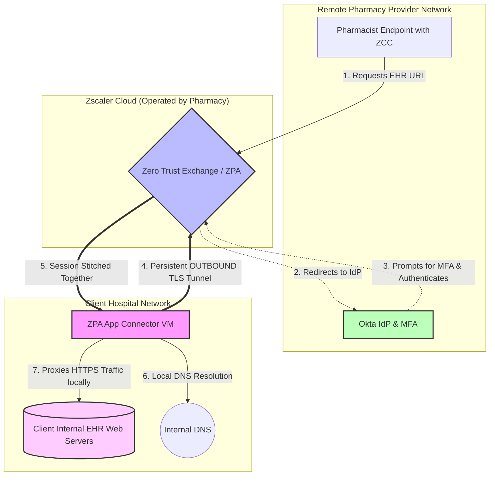

# Zero Trust Architecture: Secure EHR Access via Zscaler & Okta

## Executive Summary
This document outlines the architecture and engineering steps required to transition from a legacy VPN access model to a Zero Trust Network Access (ZTNA) model for accessing a web-based Enterprise Health Record (EHR) system (using Epic as the example). This solution utilizes Zscaler Private Access (ZPA) for secure routing and Okta for Identity and Access Management (IAM) with Multi-Factor Authentication (MFA).

## 1. Architecture Components
* **Endpoint:** Zscaler Client Connector (ZCC) installed on user devices intercepts traffic destined for the EHR.
* **Identity Provider & MFA Broker:** Okta provides Single Sign-On (SSO) and enforces Multi-Factor Authentication (MFA).
* **ZTNA Broker:** Zscaler Zero Trust Exchange (ZPA Cloud) authenticates the user and applies access policies.
* **Internal Gateway:** ZPA App Connectors are lightweight VMs deployed in the same network/VPC as the EHR. They maintain a persistent *outbound* TLS tunnel to the ZPA Cloud, eliminating the need for inbound firewall ports.
* **EHR Application:** Epic (web-based client like Hyperspace/Hyperdrive).

## 2. Engineering & Implementation Steps

### Phase 1: Identity & Access Management (IAM) Integration
1.  **Configure IdP:** Integrate Okta with Zscaler via SAML 2.0.
2.  **Enforce MFA:** Create an Okta Sign-On Policy requiring MFA (e.g., Okta Verify, Push, or hardware token) whenever a user authenticates to the Zscaler application or attempts to access the Epic application.
3.  **SCIM Provisioning:** Enable SCIM to automatically sync user groups from Okta to Zscaler for role-based policy assignment.

### Phase 2: ZPA Infrastructure Setup
4.  **Deploy App Connectors:** Spin up 2 to 4 ZPA App Connector VMs (for redundancy and load balancing) within the datacenter or VPC hosting the Epic web servers.
5.  **Authenticate Connectors:** Apply Provisioning Keys generated from the ZPA admin portal to the App Connectors so they can establish secure outbound tunnels to the Zscaler Zero Trust Exchange.

### Phase 3: Application Segmentation
6.  **Define Application Segments:** In Zscaler, define the Epic web application (e.g., `epic.hospital.org`) and specify the allowed ports (TCP 443).
7.  **Server Groups:** Map the Application Segment to the specific ZPA App Connectors that have line-of-sight to the internal Epic servers.

### Phase 4: Policy Enforcement
8.  **Access Policies:** Create rules in ZPA restricting access to the Epic App Segment. Ensure only authorized Okta groups (e.g., "Clinical_Staff") have access.
9.  **Timeout Settings:** Set strict re-authentication timeouts to ensure idle users must re-authenticate with Okta MFA before regaining access to the EHR.

### Phase 5: Endpoint Deployment
10. **Deploy ZCC:** Push the Zscaler Client Connector to endpoints via your MDM (e.g., Intune, SCCM).
11. **Configure Forwarding Profile:** Ensure ZPA is enabled so that when the user accesses the Epic URL, ZCC intercepts the traffic transparently and forwards it to the ZPA Cloud.

## 3. Proof of Concept (PoC) Diagram

Below is the logical flow of the Zero Trust architecture:

[ 1. User Endpoint ]
       │
       ├─ (A) User browses to epic.hospital.org
       ├─ (B) Zscaler Client Connector intercepts traffic
       ▼
[ 2. Okta Identity Provider ] ─── (C) Prompts for MFA ───> [ User Smartphone ]
       │
       ├─ (D) User is authenticated (SAML Assertion)
       ▼
[ 3. Zscaler Zero Trust Exchange (ZPA Cloud) ]
       │
       ├─ (E) ZPA evaluates access policies
       ├─ (F) ZPA stitches endpoint session to App Connector session
       ▲
       │  (G) Persistent Outbound TLS Tunnel (No inbound open ports!)
       │
[ 4. ZPA App Connectors (Inside your Datacenter/VPC) ]
       │
       ├─ (H) App Connector proxies the web request locally
       ▼
[ 5. Epic EHR Web Servers ]

  


```
Solution II
```

# B2B Zero Trust Architecture: Remote Pharmacy Access to Client EHR

## Executive Summary
This document outlines the architecture and engineering steps required for a **Remote Pharmacy Management Provider** to securely access a **Client’s EHR system** (e.g., Epic, Cerner) using Zscaler Private Access (ZPA). 

Unlike traditional B2B setups, this solution requires **zero site-to-site VPNs** and **zero inbound firewall ports** on the Client's network. The Remote Pharmacy fully owns and operates the identity framework, endpoints, and Zscaler tenant, while the Client network team simply hosts an outbound-only lightweight VM (the ZPA App Connector) adjacent to their EHR.

---

## 1. Operating Model & Responsibility Matrix

To make this work across two separate organizations, responsibilities must be strictly delineated:

### **Team A: Remote Pharmacy Provider IT**
* **Operates:** User Identities (IdP/SSO), MFA (Okta/DUO), User Endpoints (Laptops with Zscaler Client Connector), and the Zscaler ZPA Admin Tenant.
* **Role:** Dictates *who* gets access, enforces endpoint security, and provides the App Connector deployment files/keys to the Client.

### **Team B: Client Network / Hospital IT**
* **Operates:** The local Datacenter/VPC, the EHR Application, and the egress Firewall.
* **Role:** Provisions a lightweight Linux VM in their network, applies the provisioning key provided by Team A, and allows outbound internet access (TCP/443) for that specific VM.

---

## 2. Engineering & Implementation Steps

### Phase 1: Identity & Tenant Preparation (Remote Pharmacy Team)
1. **Configure IAM & MFA:** Integrate the Remote Pharmacy's Identity Provider (e.g., Okta, Entra ID) with their Zscaler ZPA tenant. Enforce strict MFA policies for all pharmacy staff.
2. **Generate Provisioning Keys:** Within the ZPA Admin Portal, generate an App Connector Provisioning Key. This key cryptographically binds the connector to the Remote Pharmacy's ZPA tenant.
3. **Create the Deployment Package:** Export the Provisioning Key and the standard Zscaler App Connector VM image (OVA, AMI, or Docker compose file) and securely transmit it to the Client Hospital IT team.

### Phase 2: Infrastructure Deployment (Client Hospital Team)
4. **Provision the VM:** Deploy the ZPA App Connector VM (typically 2 vCPU, 4GB RAM) in the internal subnet or DMZ that has line-of-sight routing to the internal EHR web servers.
5. **Configure Outbound Firewall:** Ensure the Client firewall allows the App Connector VM to communicate **outbound** on TCP port 443 to the Zscaler Cloud (Wildcard `*.zscaler.com` or specific ZPA broker IPs). **Ensure all inbound ports remain blocked.**
6. **Apply Provisioning Key:** Run the initial setup script on the VM using the Provisioning Key supplied by the Pharmacy team. The VM will immediately call home to the Zscaler Zero Trust Exchange.

### Phase 3: Application Segmentation (Remote Pharmacy Team)
7. **Define the Client App Segment:** In the ZPA portal, create an Application Segment for the Client's EHR (e.g., `client-ehr.local.hospital.org`). 
8. **Bypass Public DNS:** Configure ZPA to intercept this specific FQDN and route it through the App Connectors located at the Client's site, resolving DNS locally within the Client's network.

### Phase 4: Policy Enforcement (Remote Pharmacy Team)
9. **Access Policies:** Create a strict ZPA Access Policy. Example: *Only members of the Okta group "Remote_Pharmacists" can access `client-ehr.local.hospital.org`.*
10. **Device Posture Checks:** Enforce rules requiring endpoints to have active Antivirus and an encrypted hard drive before ZPA allows the connection.

### Phase 5: Endpoint Access (Remote Pharmacy Team)
11. **Deploy Zscaler Client Connector (ZCC):** Push ZCC to the remote pharmacists' laptops.
12. **Connect & Test:** The pharmacist attempts to access the Client's internal EHR URL. ZCC intercepts the request, authenticates the user via Okta/MFA, and securely stitches the session to the outbound tunnel established by the Client-hosted App Connector.

---

## 3. Architecture & Data Flow Diagram

Below is the logical data flow representing the B2B cross-network architecture:


---
