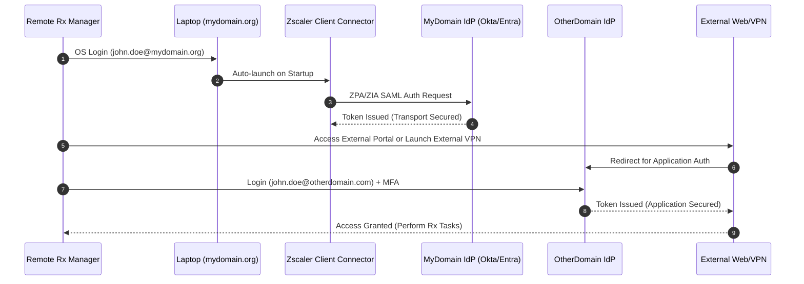
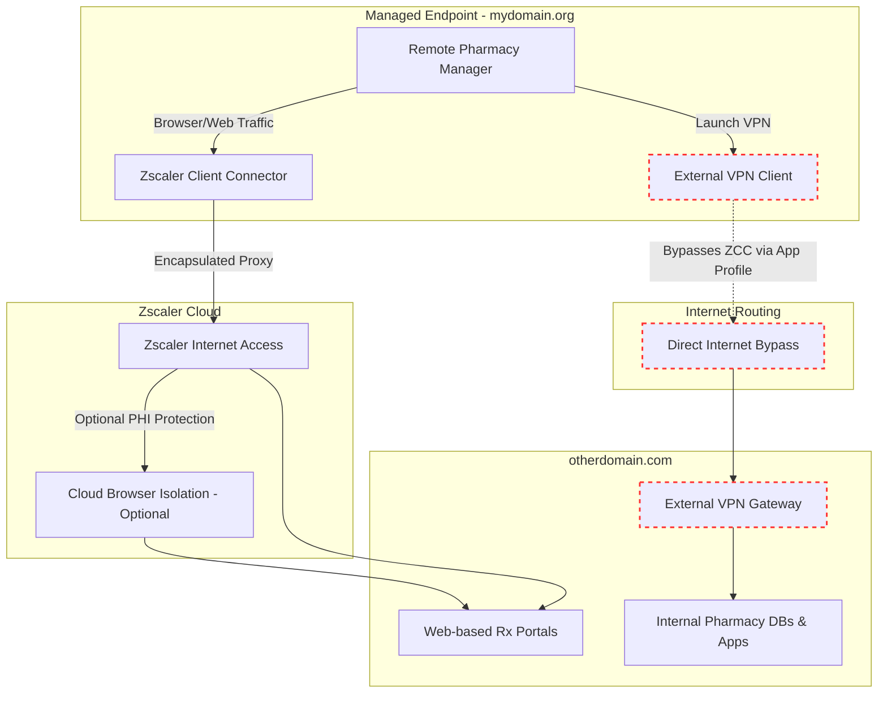
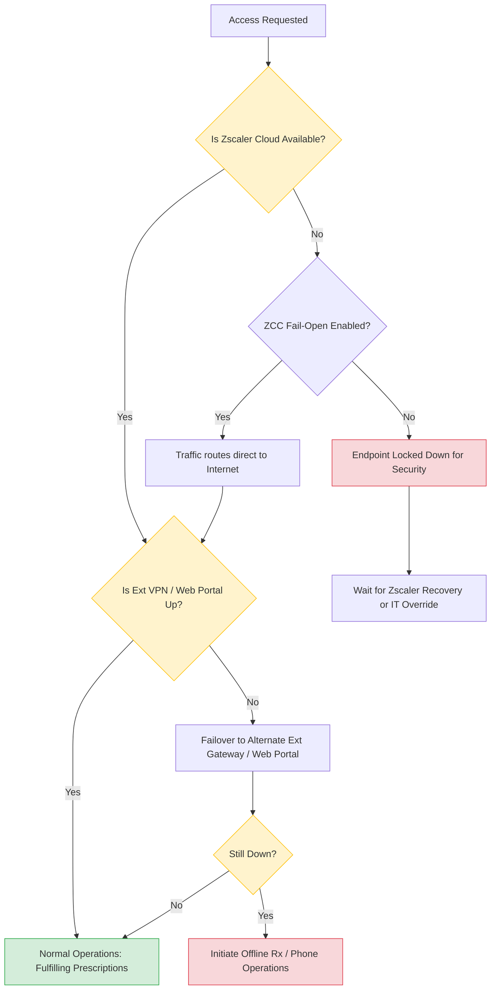

# Remote Pharmacy Manager Connectivity Architecture & Deployment Runbook
``` By: Curtis Jones ```

## Problem Statement Summary
Remote pharmacy managers on `mydomain.org` endpoints running Zscaler must authenticate and access external healthcare networks via web portals and externally managed VPNs using external identities (`otherdomain.com`), without network conflicts or security degradation.

---

## 1. Architecture Diagram of Authentication Flow

This diagram illustrates the dual-identity requirement. The endpoint and network transport layer authenticate using the internal identity (`mydomain.org`), while the application layer authenticates using the external identity (`otherdomain.com`).



---
``` The Following applies ONLY IF a client VPN is installed ```

## 2. Architecture Diagram of Network Flow

To prevent Zscaler from intercepting and breaking the external VPN connection (e.g., Cisco AnyConnect, GlobalProtect), a "VPN Bypass" must be configured. Web traffic securely flows through Zscaler Internet Access (ZIA).



---

## 3. Architecture Diagram of Business Continuity (BCDR)

This flowchart outlines the resilience strategy. It determines how the remote manager maintains access to external pharmacy networks during Zscaler outages, external VPN outages, or local connectivity failures.



---

## 4. Technical Deployment Runbook

This runbook provides the necessary configuration steps to implement the architecture. The primary technical hurdle is ensuring Zscaler Client Connector (ZCC) does not interfere with the external VPN client (encapsulation loops or MTU drops) and that SSL inspection doesn't break external certificate pinning.

### Phase 1: Prerequisite Discovery
1. **Identify External VPN Gateways:** Obtain the FQDNs and IP addresses of the `otherdomain.com` VPN gateways.
2. **Identify External VPN Executables:** Identify the process names of the 3rd-party VPN client (e.g., `vpnui.exe`, `vpngui.exe`, `PanGPA.exe`).
3. **Identify Web Portals:** List all specific FQDNs for the external web portals accessed via browser.

### Phase 2: Zscaler Client Connector (ZCC) Configuration
To allow the external VPN to connect without ZCC interception:
1. Navigate to **Zscaler Mobile Admin Portal** > **App Profiles**.
2. Select the App Profile assigned to the Pharmacy Managers.
3. Locate the **VPN Bypass** section.
4. Add the external VPN gateway IP subnets to the **Bypass specific IPs/Subnets** list.
5. *Alternative (Endpoint level):* Under **Hostname or IP Address Bypass for VPN Gateway**, add the external FQDNs.

### Phase 3: PAC File Modifications
Ensure the system proxy does not attempt to proxy the external VPN traffic:
1. Open your ZIA Forwarding / PAC file editor.
2. Add a bypass rule for the external VPN domains and IP addresses:
   ```javascript
   // Bypass External Healthcare Network VPN Gateways
   if (dnsDomainIs(host, ".otherdomain.com") || 
       isInNet(resolved_ip, "X.X.X.X", "255.255.255.0")) {
       return "DIRECT";
   }
   ```
3. Save and deploy the PAC file version.

### Phase 4: ZIA SSL Inspection Exclusions
Many external VPN clients and healthcare portals use strict Certificate Pinning. Zscaler’s SSL inspection will break these connections.
1. Navigate to **Zscaler Internet Access (ZIA)** > **Policy** > **SSL Inspection**.
2. Create a new SSL Inspection Policy Rule.
3. **Name:** `Bypass SSL - External Healthcare Domain`.
4. **URL Categories / Custom Domains:** Add the FQDNs of the external Web Portals and VPN Gateways.
5. **Action:** `Do Not Inspect`.
6. Ensure this rule is prioritized above any "Inspect All" rules.

### Phase 5: Identity & Browser Setup (Endpoint Management)
1. **Browser Profiles:** Deploy a managed browser configuration (e.g., Edge/Chrome) with a dedicated profile for `otherdomain.com`. This separates `mydomain.org` cookies/cache from the external identity and prevents single-sign-on (SSO) conflicts.
2. **Credential Management:** Advise users to use their password manager for `john.doe@otherdomain.com`, as it will not sync with their internal Active Directory password.

### Phase 6: Testing & Validation
1. Have a test Pharmacy Manager log into the Windows endpoint. Verify Zscaler authenticates transparently.
2. Launch the External VPN client and authenticate with the external identity.
3. Validate connection stability (check for MTU drops or reconnect loops). 
4. Verify internal routing (e.g., run `tracert` to an internal `otherdomain.com` IP to ensure traffic is flowing through the external VPN tunnel and not being captured by Zscaler).
5. Access the web portal through the browser and verify successful external IdP redirection.
 ---
**[Curtis Jones - Security Architect Portfolio](https://curtis9662.github.io/)** showcases his 18+ years of high-level expertise in cybersecurity, Identity Access Management (IAM), and Secure Hybrid-Cloud Architectures. The site serves as a comprehensive professional profile, featuring his architectural timeline, core technical skills like DevSecOps and AI defense, and direct links to his project repositories and operational workflows.
