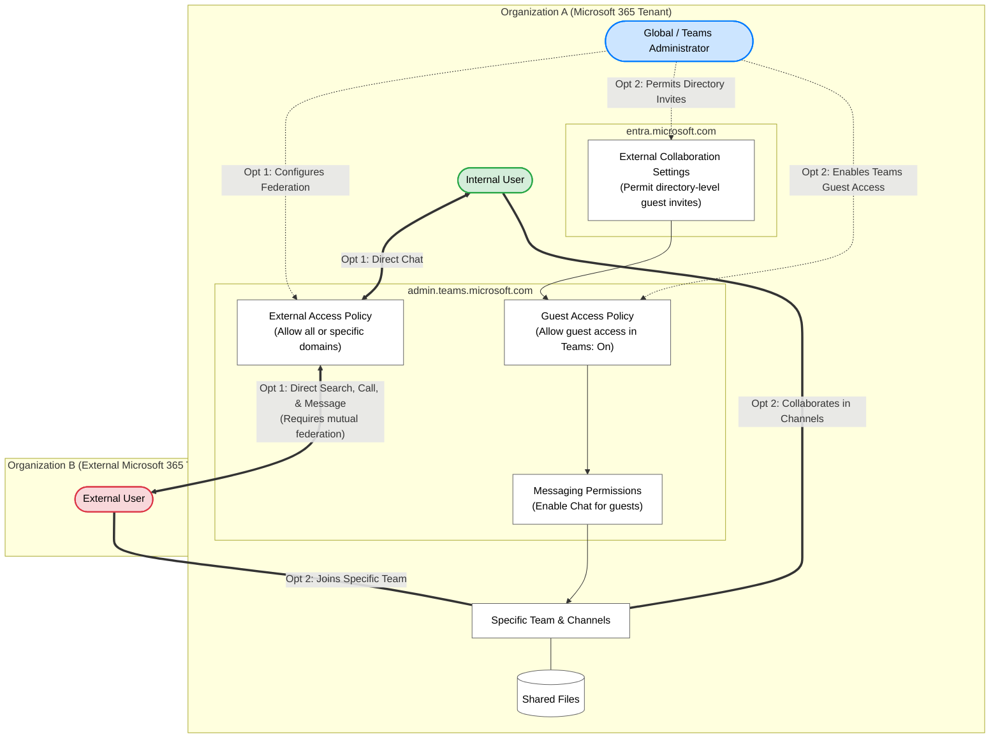

## Microsoft Teams Guest access
# Option 1: Enable External Access (Direct Chat)
Use this if you simply want users to be able to search for, call, and message people in other Microsoft 365 organizations without adding them to a specific Team. Both organizations must have this enabled to communicate.

1. **Sign in to the Teams Admin Center:** admin.teams.microsoft.com. Log in using an account with Global Administrator or Teams Administrator privileges.
2. **Navigate to External Access:** In the left-hand navigation pane, go to Users and select External access.
3. **Choose your domain configuration:** Under the section for Teams and Skype for Business users, select your preferred setting:
   * Allow all external domains: (Default) Open federation with any other Teams organization.
   * Allow only specific external domains: You must click Add external domains and enter the exact domains (e.g., partnercompany.com) you want to allow.
4. **Save and test:** Click Save. It may take a few hours for federation policies to fully sync. Test the configuration by sending a chat request to a user in the federated organization.

Make Change Here → https://admin.teams.microsoft.com/company-wide-settings/external-communications

Add <ORG> Domain for cross environment collab

# Option 2: Enable Guest Access (Team and Channel Collaboration)
Use this if you need external individuals to actually join your specific Teams, access shared files, and chat within those team channels.

1. **Verify Entra ID collaboration settings:** entra.microsoft.com. Guest invitations must first be permitted at the directory level. In the Microsoft Entra admin center, navigate to External identities > External collaboration settings and ensure that admins or members are allowed to invite guests.
2. **Navigate to Guest Access in Teams:** admin.teams.microsoft.com. In the Teams Admin Center, go to Users and select Guest access.
3. **Enable Guest Access:** Toggle Allow guest access in Teams to On.
4. **Configure guest permissions:** Review the settings under the Messaging section. Ensure that Chat is enabled for guests so they can participate in conversations.
5. **Save changes:** Click Save. Note: It can take between 2 and 24 hours for guest access settings to take full effect across your Microsoft 365 tenant.

## Security Architecture Diagram:

