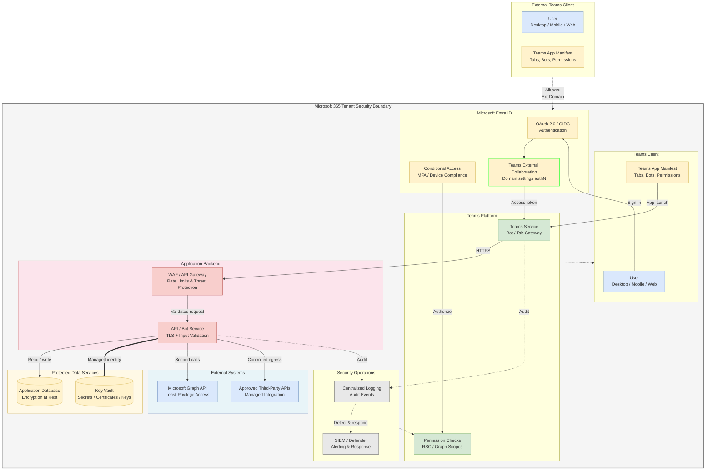
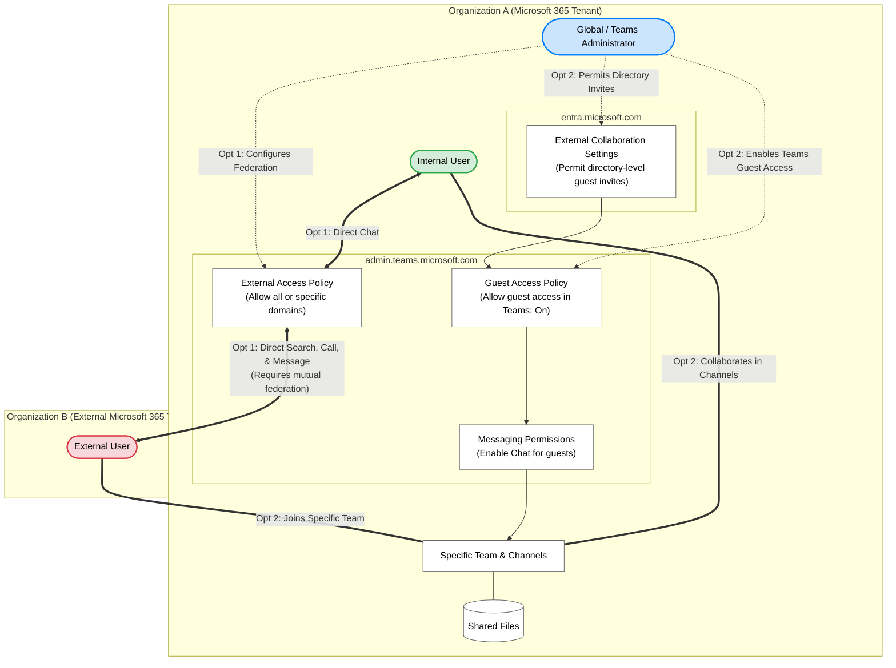

## Microsoft Teams Guest access
# Option 1: Enable External Access (Direct Chat)
Use this if you simply want users to be able to search for, call, and message people in other Microsoft 365 organizations without adding them to a specific Team. Both organizations must have this enabled to communicate.

1. **Sign in to the Teams Admin Center:** admin.teams.microsoft.com. Log in using an account with Global Administrator or Teams Administrator privileges.
2. **Navigate to External Access:** In the left-hand navigation pane, go to Users and select External access.
3. **Choose your domain configuration:** Under the section for Teams and Skype for Business users, select your preferred setting:
   * Allow all external domains: (Default) Open federation with any other Teams organization.
   * Allow only specific external domains: You must click Add external domains and enter the exact domains (e.g., partnercompany.com) you want to allow.
4. **Save and test:** Click Save. It may take a few hours for federation policies to fully sync. Test the configuration by sending a chat request to a user in the federated organization.

Make Change Here → https://admin.teams.microsoft.com/company-wide-settings/external-communications

Add <ORG> Domain for cross environment collab

# Option 2: Enable Guest Access (Team and Channel Collaboration)
Use this if you need external individuals to actually join your specific Teams, access shared files, and chat within those team channels.

1. **Verify Entra ID collaboration settings:** entra.microsoft.com. Guest invitations must first be permitted at the directory level. In the Microsoft Entra admin center, navigate to External identities > External collaboration settings and ensure that admins or members are allowed to invite guests.
2. **Navigate to Guest Access in Teams:** admin.teams.microsoft.com. In the Teams Admin Center, go to Users and select Guest access.
3. **Enable Guest Access:** Toggle Allow guest access in Teams to On.
4. **Configure guest permissions:** Review the settings under the Messaging section. Ensure that Chat is enabled for guests so they can participate in conversations.
5. **Save changes:** Click Save. Note: It can take between 2 and 24 hours for guest access settings to take full effect across your Microsoft 365 tenant.

## Security Architecture Diagram:

```mermaid

flowchart TD
    %% Define color classes matching the original draw.io hex codes
    classDef tenant fill:#f5f5f5,stroke:#666666,stroke-width:2px;
    classDef client fill:#e8f4f8,stroke:#6c8ebf;
    classDef entra fill:#fff0e6,stroke:#d79b00;
    classDef platform fill:#e8f5e9,stroke:#82b366;
    classDef backend fill:#fce4ec,stroke:#b85450;
    classDef data fill:#fff9e6,stroke:#d6b656;
    classDef secops fill:#f5f5f5,stroke:#666666;
    classDef extSys fill:#e8f4f8,stroke:#6c8ebf;
    
    classDef user fill:#dae8fc,stroke:#6c8ebf;
    classDef manifest fill:#fff2cc,stroke:#d6b656;
    classDef auth fill:#fff2cc,stroke:#d6b656;
    classDef collabAuth fill:#fff2cc,stroke:#33ff33,stroke-width:2px;
    classDef platSvc fill:#d5e8d4,stroke:#82b366;
    classDef backSvc fill:#f8cecc,stroke:#b85450;
    classDef db fill:#fff2cc,stroke:#d6b656;
    classDef secLog fill:#e8e8e8,stroke:#666666;

    subgraph ExtClientWrapper ["External Teams Client"]
        ExtUser["User<br>Desktop / Mobile / Web"]:::user
        ExtManifest["Teams App Manifest<br>Tabs, Bots, Permissions"]:::manifest
    end

    subgraph Tenant ["Microsoft 365 Tenant Security Boundary"]
        
        subgraph Client ["Teams Client"]
            IntUser["User<br>Desktop / Mobile / Web"]:::user
            IntManifest["Teams App Manifest<br>Tabs, Bots, Permissions"]:::manifest
        end

        subgraph Entra ["Microsoft Entra ID"]
            OAuth["OAuth 2.0 / OIDC<br>Authentication"]:::auth
            CondAccess["Conditional Access<br>MFA / Device Compliance"]:::auth
            ExtAuth["Teams External Collaboration<br>Domain settings authN"]:::collabAuth
        end

        subgraph Platform ["Teams Platform"]
            BotGateway["Teams Service<br>Bot / Tab Gateway"]:::platSvc
            PermChecks["Permission Checks<br>RSC / Graph Scopes"]:::platSvc
        end

        subgraph Backend ["Application Backend"]
            APISvc["API / Bot Service<br>TLS + Input Validation"]:::backSvc
            WAF["WAF / API Gateway<br>Rate Limits & Threat Protection"]:::backSvc
        end

        subgraph ProtectedData ["Protected Data Services"]
            AppDB[("Application Database<br>Encryption at Rest")]:::db
            KeyVault[("Key Vault<br>Secrets / Certificates / Keys")]:::db
        end

        subgraph SecOps ["Security Operations"]
            AuditLog["Centralized Logging<br>Audit Events"]:::secLog
            SIEM["SIEM / Defender<br>Alerting & Response"]:::secLog
        end

        subgraph ExtSystems ["External Systems"]
            GraphAPI["Microsoft Graph API<br>Least-Privilege Access"]:::user
            ThirdParty["Approved Third-Party APIs<br>Managed Integration"]:::user
        end
    end

    %% Apply structural classes
    class Tenant tenant;
    class Client client;
    class Entra entra;
    class Platform platform;
    class Backend backend;
    class ProtectedData data;
    class SecOps secops;
    class ExtSystems extSys;
    class ExtClientWrapper client;

    %% Data flows and relationships
    ExtClientWrapper -.->|"Allowed<br>Ext Domain"| Entra
    IntUser -->|"Sign-in"| OAuth
    IntManifest -->|"App launch"| BotGateway
    
    OAuth --> ExtAuth
    ExtAuth -->|"Access token"| BotGateway
    CondAccess -->|"Authorize"| PermChecks
    
    BotGateway -->|"HTTPS"| WAF
    WAF -->|"Validated request"| APISvc
    
    APISvc -->|"Read / write"| AppDB
    APISvc ==>|"Managed identity"| KeyVault
    
    APISvc -->|"Scoped calls"| GraphAPI
    APISvc -->|"Controlled egress"| ThirdParty
    
    BotGateway -.->|"Audit"| AuditLog
    APISvc -.->|"Audit"| AuditLog
    AuditLog -.->|"Detect & respond"| SIEM
    
    %% Implicit structural returns/loops identified in the XML
    Platform -.-> Client
    SecOps -.-> PermChecks

```
> Architecture Notes

Topic: External Teams Collaboration Security Architecture Diagram.

Citation Links: Microsoft Teams External Communications Settings.

Domain Trust Requirements: * Settings must coincide across domains.

In order to chat and meet with people in external domains, the organizations that you trust must also trust your organization.

Access Policies:

Allow only specific external domains: By adding domains to an Allow list, you limit external access to only the allowed domains. Once you set up a list of allowed domains, all other domains are blocked.

Configure granular domains in external access policies: External access policies give you granular control over external collaboration in Microsoft Teams. This allows you to create custom policies that define which external domains can be allowed or blocked for users and groups, unlike organization settings that apply to everyone.

```mermaid
flowchart TD
    %% Based on configuration steps[cite: 1]
    classDef tenant fill:#f9f9f9,stroke:#333,stroke-width:2px,color:#000;
    classDef internal fill:#d4edda,stroke:#28a745,stroke-width:2px,color:#000;
    classDef external fill:#f8d7da,stroke:#dc3545,stroke-width:2px,color:#000;
    classDef admin fill:#cce5ff,stroke:#007bff,stroke-width:2px,color:#000;
    classDef component fill:#fff,stroke:#666,stroke-width:1px,color:#000;

    subgraph OrgA["Organization A (Microsoft 365 Tenant)"]
        direction TB
        AdminA(["Global / Teams Administrator"]):::admin
        InternalUser(["Internal User"]):::internal

        subgraph Entra["entra.microsoft.com"]
            B2B["External Collaboration Settings<br/>(Permit directory-level guest invites)"]:::component
        end

        subgraph TeamsAdmin["admin.teams.microsoft.com"]
            ExtAccess["External Access Policy<br/>(Allow all or specific domains)"]:::component
            GuestAccess["Guest Access Policy<br/>(Allow guest access in Teams: On)"]:::component
            GuestPerms["Messaging Permissions<br/>(Enable Chat for guests)"]:::component
        end

        Team["Specific Team & Channels"]:::component
        Files[("Shared Files")]:::component

        Team --- Files
    end

    subgraph OrgB["Organization B (External Microsoft 365 Tenant)"]
        ExtUser(["External User"]):::external
    end

    %% Option 1: External Access Mapping[cite: 1]
    AdminA -. "Opt 1: Configures Federation" .-> ExtAccess
    ExtAccess <=="Opt 1: Direct Search, Call, & Message<br/>(Requires mutual federation)"==> ExtUser
    InternalUser <=="Opt 1: Direct Chat"==> ExtAccess

    %% Option 2: Guest Access Mapping[cite: 1]
    AdminA -. "Opt 2: Permits Directory Invites" .-> B2B
    AdminA -. "Opt 2: Enables Teams Guest Access" .-> GuestAccess
    B2B --> GuestAccess
    GuestAccess --> GuestPerms
    GuestPerms --> Team

    ExtUser == "Opt 2: Joins Specific Team" === Team
    InternalUser == "Opt 2: Collaborates in Channels" === Team
```
> ## Images for 1st Hand PoC

 
 **Guest Access**
 
 **External Access**
 - Ensure "Allow Only Specific External Domains" is selected, and request external domains teams settings attestation / 

https://admin.teams.microsoft.com/policies/external-communications/add 

Add the specific Domain(s) (multiple can be added to one policy in initial configuration)

We restrict Unmanaged Msft Accounts, Custom Comm Srvs, and Skype for Business is off

If There is an update issue you will see:

Which usually means the Subscription is owned by a larger Tenant or the user is not authorized to make changes even w/ Teams Admin Access

---
## B2B Access
Access https://entra.microsoft.com/#view/Microsoft_AAD_IAM/CrossTenantAccessSettingsList.ReactView → Default

Make the updates as approved

