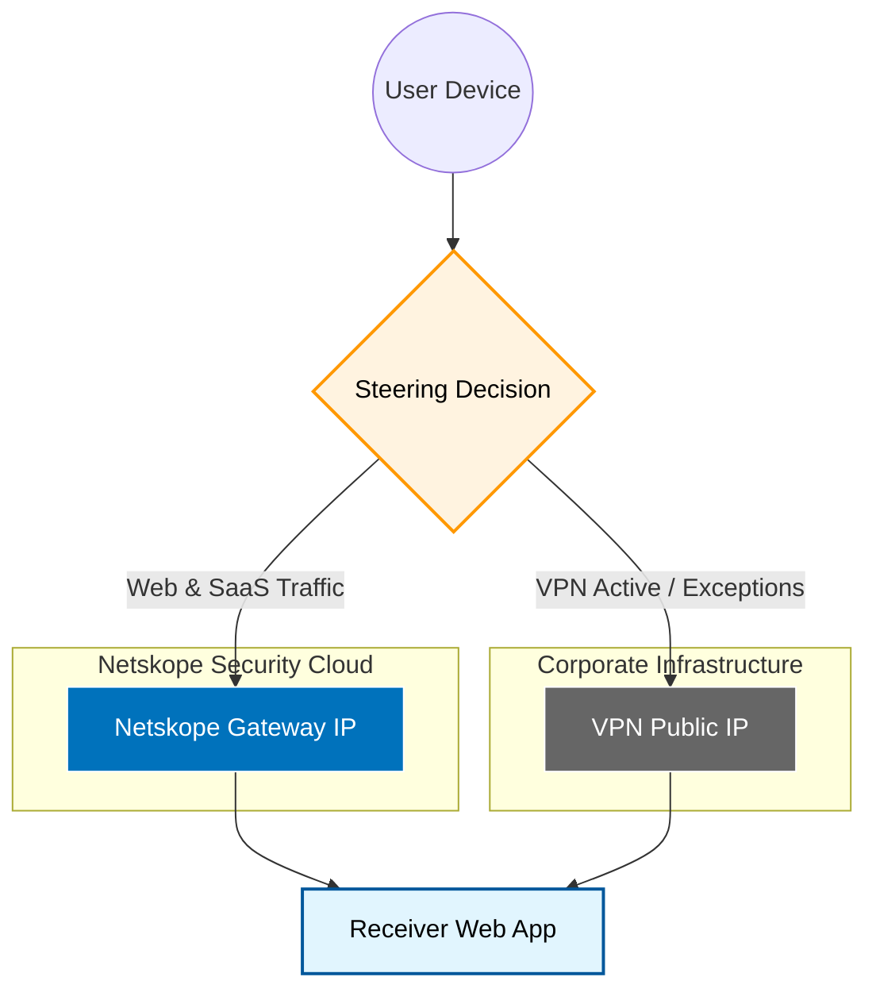

# 🌐 Connectivity & Egress Architecture: OpenVPN vs. Netskope

### **Executive Summary: Traffic Steering & Identity Visibility**
In our hybrid operating environment, the "Egress IP" (the identity we present to the world) is governed by our **Steering Policy**. This mechanism decides whether a user's traffic traverses our legacy perimeter (VPN) or our modern Security Service Edge (Netskope).

This document outlines the decision logic used to route traffic and what external partners (Receivers) see during interaction.

---

## 🚀 The Two Paths of Data Egress

### **Scenario A: The Modern Secure Path (Netskope)**
*The primary path for SaaS, Web, and Cloud-native applications.*
* **The Flow:** User Device ➔ Netskope Security Cloud ➔ **Destination**
* **The Egress Identity:** **Netskope Global Gateway IP**
* **The Value:** Traffic undergoes full SSL inspection, Data Loss Prevention (DLP), and advanced threat protection mid-flight. The receiver validates a trusted Netskope entry point.

### **Scenario B: The Legacy Tunnel (OpenVPN)**
*The fallback path for internal-only resources or specific bypassed streams.*
* **The Flow:** User Device ➔ OpenVPN Concentrator ➔ Corporate Firewall ➔ **Destination**
* **The Egress Identity:** **Corporate Data Center Static IP**
* **The Value:** Provides direct, point-to-point connectivity for legacy internal applications that have not yet been modernized for the cloud.

---

## 📊 Traffic Flow Visualization

